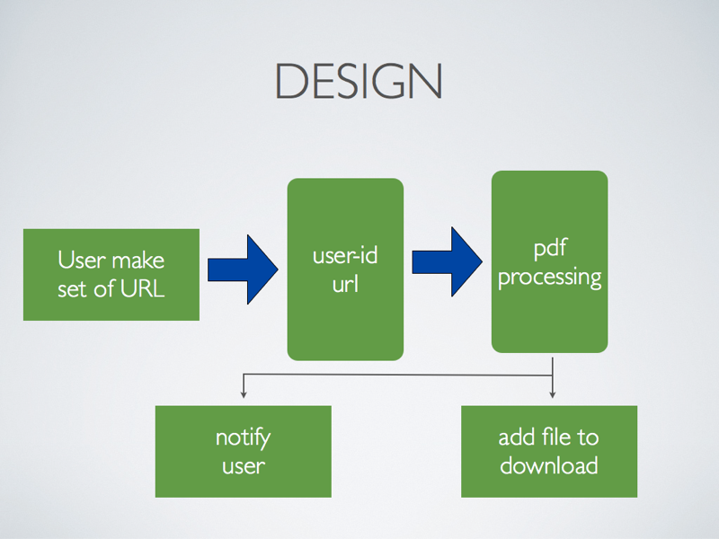

# Demo application for demostrate PHP, RabbitMQ and wkhtmltopdf

- PHP - [http://www.php.net](http://www.php.net)
- RabbitMQ - [http://www.rabbitmq.com/](http://www.rabbitmq.com/)
- wkhtmltopdf - [http://code.google.com/p/wkhtmltopdf/](http://code.google.com/p/wkhtmltopdf/)

##  Demo

Basic PHP application for creating PDF file from some url website by command line utility wkhtmltopdf. I can demostrate using RabbitMQ on this example.

## Install

For installing on Mac OS X i used [homebrew](http://mxcl.github.com/homebrew/).

	brew install rabbitmq
	brew install wkhtmltopdf
	
## Design

Here is basic design of applicatin

- user make SET of URLs
- URLs are proceed by wkhtmlpdf
- user are notify about jobs done and file are ready to download

	

## Tools

- [RabbitMQ managment tool](http://localhost:55672/mgmt/)